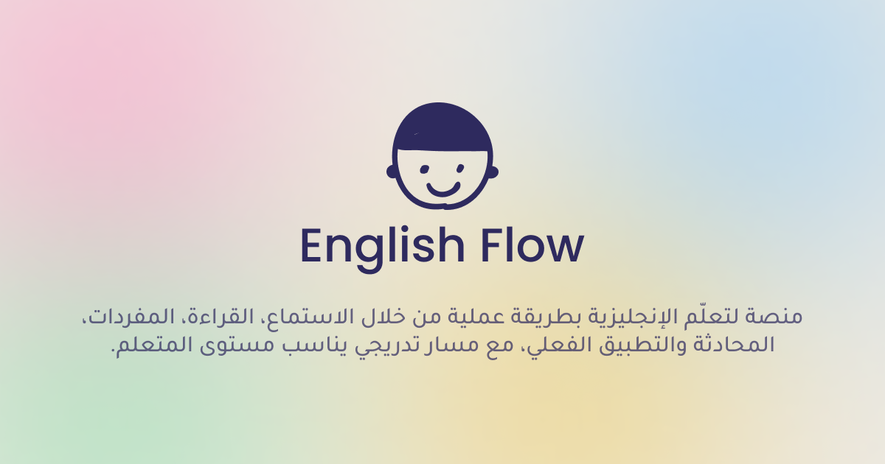

# English-Flow — Learn English

[](https://nextjs.org/)
[](https://react.dev/)
[](https://www.typescriptlang.org/)
[](https://tailwindcss.com/)

> **Language is acquired through meaningful exposure and active use — not by memorizing isolated rules.**

A self-directed English learning platform for Arabic speakers: vocabulary, sentences, and grammar organized by CEFR levels, with local text-to-speech and progress tracking — Arabic-first throughout (full RTL).





## Sections

| Route | Content |
|---|---|
| `/` | Learning roadmap: the four stages + self-learning tips |
| `/english` | Overview: all sections + progress summary |
| `/english/terms` | **2,000 words** with Arabic translations, CEFR levels, and categories, plus search, filters, and pagination |
| `/english/sentences` | **2,000 sentences** with Arabic translations, CEFR levels, and grammar patterns |
| `/english/grammar` | **179 grammar topics** (9 explained + 170 from CEFR-J with explanations and spoken examples) |
| `/english/listen` | Free listening: type any text and hear it + sample texts |
| `/english/resources` | 10 YouTube channels (Arabic/foreign) + 5 books with real images |

## Features

* **Local Piper TTS** that works offline after the first download, with four voices (female/male) plus volume and speed controls
* **Progress tracking**: check off ✓ what you master, with a progress bar and counter per section — stored on your device (localStorage)
* **Light/dark mode** saved automatically, with Arabic fonts (IBM Plex Sans Arabic + Inter)
* **Instant search** in English and Arabic, filtering by category and level, paginated lists
* GSAP motion (entrances, pinned journey, counters) + smooth scrolling, all disabled under `prefers-reduced-motion`
* Fully responsive: mobile, tablet, and desktop with no horizontal overflow

## Learning Path

1. **Foundation** (weeks 1–3): high-frequency vocabulary + simplified listening
2. **Guided Immersion** (weeks 4–8): content slightly above your level
3. **Production** (from week 6): Shadowing + weekly conversation
4. **Refinement** (after two months): grammar only to explain your actual mistakes

## Data

All learning content is generated by a documented pipeline (`scripts/pipeline/`) from real sources — no invented translations:

| Source | Used for | License |
|---|---|---|
| Tatoeba | 48k English↔Arabic sentences | CC BY 2.0 FR |
| Open English WordNet 2025 | Vocabulary definitions and relations | CC BY 4.0 |
| CEFR-J | Word and grammar levels | Research/commercial with citation |
| FreeDict eng-ara / Wiktionary | Arabic dictionary translations | GPL / CC BY-SA |
| Open Library / YouTube | Book covers and channel images | Hotlinks with fallback |

Full details: `DATA_SOURCES.md`. Pipeline steps: `scripts/pipeline/README.md`.
The final curriculum served by the site: `data/pipeline/final/` (exactly 2,000 words + 2,000 sentences, validated).

## Tech Stack

* **Next.js 16** (App Router) + **React 19** + **TypeScript 5**
* **Tailwind CSS 4** + MD3 tokens (`--md-sys-*`) + `@material/web` components (slider, radio, buttons)
* **GSAP** (+ ScrollTrigger) and **Lenis** for motion and scrolling
* **Piper TTS** via `speech-to-speech` + `onnxruntime-web` (runs in the browser)
* **lucide-react** for icons, **pnpm** for packages, **ESLint** and **Playwright** for checks

## Project Structure

```text
English-Flow/
├── app/                    # Routes (home + english/*)
├── components/english/     # Organized by domain (each with index.ts barrel)
│   ├── layout/             # EnglishNav, MobileNav, SiteLogo, Pagination
│   ├── ui/                 # EmptyState, LevelBadge, SectionHead, ThemeToggle, ResourceImage
│   ├── cards/              # WordCard, SentenceCard, GrammarCard, GrammarTopicCard, ResourceCard (+ legacy TermCard)
│   ├── filters/            # CategoryFilter, LevelFilter, SearchInput
│   ├── audio/              # SpeakButton, ReaderPanel, VoiceSettings
│   ├── motion/             # Reveal, HeroIntro, OwlHero, SmoothScroll, ScrollProgress
│   ├── progress/           # CompleteButton, HomeProgress, ProgressHeader, ProgressFilteredList, StatsStrip
│   ├── providers/          # ThemeProvider, ToastProvider
│   └── hooks/              # useReducedMotion, useRevealOnScroll, useSpokenAudio
├── data/
│   ├── english/            # App data (curriculum, resources, categories)
│   └── pipeline/           # Raw → Processed → Final + SCHEMA.md
├── lib/                    # Loaders, settings, Piper, progress
├── types/                  # TypeScript types
├── public/                 # Logo and icons
├── DATA_SOURCES.md         # Sources and licenses
└── README.md
```

## Development

```bash
pnpm install
pnpm dev        # http://localhost:3000
```

Other commands:

```bash
pnpm build && pnpm start   # production build
pnpm lint                  # ESLint check
pnpm typecheck              # TypeScript check
```

> Note: the first pronunciation click downloads the voice model (~60MB) once, then works offline.
> On low-memory machines the `dev` and `start` scripts cap Node memory automatically.

---

<p align="center">
  <strong>English-Flow</strong><br>
  Learn naturally. Practice actively. Master English.
</p>
